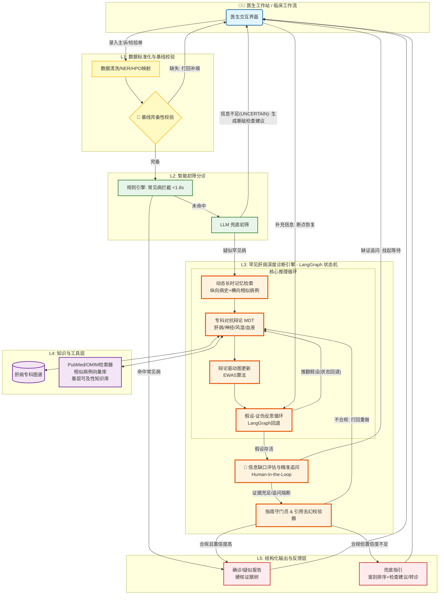

# Medical-Agent 医疗多智能体诊断系统

> 基于五层架构的基层医院肝病辅助诊断系统，融合 DeepRare + MAGIC + LangGraph

***

## 📋 项目简介

Medical-Agent 是一款专为基层医院设计的罕见肝病辅助诊断系统。该系统融合 DeepRare、MAGIC 与 RareAgents 的核心机制，基于 LangGraph 状态机编排，构建了一个具备对抗性推理、可证伪验证、强溯源能力、带记忆功能、会主动追问、知进退的多智能体诊断系统。

### 系统概述

在基层医院，罕见肝病的诊断面临着三大挑战：

1. **表型迷雾**：症状复杂多变，难以识别
2. **首诊信息不全**：病历信息极度缺失
3. **医生经验局限**：罕见病诊断经验不足

传统的医疗 AI 多为被动接收数据的"离线判读工具"，在信息残缺时极易产生幻觉或给出无临床价值的结论。

Medical-Agent 旨在打破这一僵局，实现从"被动判读"到"主动推理"的代际跃升。系统深度融汇了：

- **DeepRare** 的可溯源证伪机制
- **MAGIC** 的辩论驱动图推理
- **RareAgents** 的多专科对抗机制

构建了以动态记忆为先验、以专科认知偏误对抗为核心、以假设-证伪为闭环的深度推理引擎。

更重要的是，系统直面基层临床现实，通过从 L1 基线拦截到 L3 精准追问再到 L5 兜底指引的全链路信息缺口闭环，真正成为基层医生得心应手的"数字同事"——不仅能给出锚定真实文献的硬核诊断，更懂得在迷茫时主动索要关键证据，在力所不及时给出明确的检查与转诊方向。

***

## 🌟 核心特性

### 一、推理范式革新：从单线顺应到对抗求真

| 特性                          | 描述                                                                                    |
| --------------------------- | ------------------------------------------------------------------------------------- |
| ⚔️ **角色驱动与偏误对抗**            | 摒弃传统的模态流水线，构建带"认知偏误"的专科 Agent 池（肝病/神经/风湿/血液）。通过强制交叉质证，利用观点冲突撕开罕见病的伪装，打破单 LLM 推理的确认偏误。 |
| 🔍 **假设-证伪反思闭环**            | 变"盲目重试"为"主动证伪"。系统主动搜寻排他性反例推翻错误假设，并依托 LangGraph 的状态回退边，彻底阻断死胡同，实现逻辑上的推倒重来。             |
| 🧩 **辩论驱动图推理 (MAGIC EWAS)** | 辩论结果不再仅是文本，而是作为先验信号，通过确定性算法（EWAS）动态更新知识图谱的节点/边权重，让静态图谱在推理中"活"起来，精准激活诊断路径。             |

### 二、知识溯源与增强：拒绝幻觉，拥抱先验

| 特性                | 描述                                                                          |
| ----------------- | --------------------------------------------------------------------------- |
| 🧠 **动态长时记忆先验**   | 纵向提取患者跨周期病史趋势，横向检索群体级相似罕见病例，为 MDT 辩论提供"类比推理"的直觉先验，有效打破罕见病诊断的冷启动魔咒。          |
| 🔗 **硬证据锚定与双重去幻** | 强制执行"无检索不推理"，所有论据必须绑定真实外部源。独创引用去幻校验器，执行 URL 可达性与语义一致性双重校验，彻底剔除大模型幻觉链接与断章取义。 |

### 三、临床工作流深度适配：全链路信息缺口闭环

| 特性                  | 描述                                                                                                 |
| ------------------- | -------------------------------------------------------------------------------------------------- |
| 🛡️ **三层主动获取与追问机制** | 完美契合基层不全病历现状。L1 基线校验拦截"无米之炊"；L3 鉴别追问（HITL）基于竞争假设精准索要证据（限2轮防骚扰）；L2/L5 兜底指引在分诊僵局或确诊无力时，输出明确的下一步检查方向。 |

### 四、医疗安全与合规底线：知进退，守规矩

| 特性               | 描述                                                                                                |
| ---------------- | ------------------------------------------------------------------------------------------------- |
| 🛡️ **指南守门强校验**  | 诊断输出前，强制过审 AASLD/EASL 指南必需条件，不符合临床规范的结论坚决打回重做，杜绝大模型"自圆其说"。                                        |
| 🏥 **基层可及性极致过滤** | 深刻理解基层医疗约束。系统输出的检查建议自动经过基层可及性知识库过滤，遇不可及项目（如肝穿刺/全外显子）自动降级为替代方案（如 FibroScan/热点筛查）或直接生成转诊建议，绝不开空头支票。 |

***

## 🏗️ 五层系统架构

```text
┌─────────────────────────────────────────────────────────────────────────────┐
│ 【L1: 数据标准化与基线校验】 (规则驱动，确保运转底线)                           │
│ • 文本清洗与 HPO 映射                                                        │
│ • 🛑 核心基线拦截 (缺 ALT/AST 等硬性阻断，要求医生补填)                        │
└─────────────────────────────────────────────────────────────────────────────┘
                                    ↓ (基线完备放行)
┌─────────────────────────────────────────────────────────────────────────────┐
│ 【L2: 智能初筛分诊模块】 (本地小模型+规则，响应 < 1.8s)                          │
│ • 常见肝病快速拦截                                                            │
│ • 罕见病预警                                                                 │
│ • 🛑 LLM 兜底 (信息极缺时生成分诊期基础检查单)                                  │
└─────────────────────────────────────────────────────────────────────────────┘
                                    ↓ (判定为疑似罕见病)
┌─────────────────────────────────────────────────────────────────────────────┐
│ 【L3: 罕见肝病深度诊断层】 (LangGraph 状态机 + 医疗中间件)                     │
│                                                                             │
│  1. 动态长时记忆检索 (纵向时间轴摘要 + 横向相似病例向量库)                       │
│                           ↓                                                 │
│  2. 动态组队 (MDT Manager 按需从 6 大专科 Agent 池唤醒角色)                     │
│                           ↓                                                 │
│  3. 基于证据的对抗辩论 (FIPA-ACL 精简协议，强制引用 L4 真实文献与先验)             │
│                           ↓                                                 │
│  ┌─────────────────────────────────────────────────────────────────────┐    │
│  │ 4. 鉴别信息缺口评估与精准追问 (HITL 挂起) ⭐核心认知层                   │    │
│  │    • 识别鉴别关键缺证                                                    │    │
│  │    • 挂起状态机 (Interrupt)                                              │    │
│  │    • 医生补充新事实后断点恢复                                              │    │
│  └─────────────────────────────────────────────────────────────────────┘    │
│                           ↓                                                 │
│  5. 证伪反思循环 (主动搜寻排他证据，推翻错误假设，触发 LangGraph 回退边)          │
│                           ↓                                                 │
│  6. 辩论驱动图更新 (纯 Python 确定性 EWAS 算法更新图谱权重)                    │
│                           ↓                                                 │
│  7. 指南守门员 & 引用去幻校验器 (强制比对 AASLD/EASL，剔除断章取义与 404 链接)  │
└─────────────────────────────────────────────────────────────────────────────┘
                                    ↓
┌─────────────────────────────────────────────────────────────────────────────┐
│ 【L4/L5: 基层可及性知识与输出层】 (权威、可验证、知进退)                         │
│ • L4: 本地 SQLite 镜像库 / PubMed API / 罕见病病例向量库 (支持动态闭环写入)      │
│ • L5 确诊 (≥92% 双阈值): 诊断报告 + 硬核证据树 + 相似病例展示                   │
│ • L5 兜底 (INCONCLUSIVE): 鉴别排序 + 基层可及性检查过滤(推荐替代方案) + 转诊指引 │
└─────────────────────────────────────────────────────────────────────────────┘
```

<br />

### 架构流程说明

1. **L1 层 - 数据标准化与基线校验**
   - 文本清洗与结构化（正则、NER）
   - 指标单位统一
   - 缺失值标记
   - HPO 术语提取（症状映射）
   - 核心基线拦截：缺少 ALT/AST 等关键指标时硬性阻断
2. **L2 层 - 智能初筛分诊模块**
    ```mermaid
    flowchart TD
        Start[输入: L1标准化患者事实 raw_facts] --> RuleEval{执行规则引擎评估};

        %% 规则引擎分支
        RuleEval -->|命中核心条件| CalcConf[计算规则置信度\nBase + Supportive权重];
        RuleEval -->|核心条件UNKNOWN| Pending[规则状态: PENDING\n记录缺失核心指标];
        RuleEval -->|核心条件不满足| NoMatch[规则状态: MISS];

        CalcConf --> CheckHigh{置信度 ≥ 0.80?};
        CheckHigh -->|是| RouteCommon[RULE_ROUTE: COMMON/RARE_ALERT\n输出确定性分诊结果];
        CheckHigh -->|否 0.60-0.79| RouteLLM[RULE_ROUTE: 边缘疑似\n转交LLM兜底评估];

        Pending --> GapAnalysis[缺口分析: 收集缺失的核心指标];
        NoMatch --> GapAnalysis;

        %% LLM 兜底分支
        RouteLLM --> LLMAssess[LLM结构化评估\nPrompt:仅基于事实分类];
        LLMAssess --> LLMResult{LLM判定结果};

        LLMResult -->|LIKELY_COMMON/RARE\n且无关键缺证| RouteFinal1[LLM_ROUTE: 疑似分诊\n进入L3或常见病通道];
        LLMResult -->|UNCERTAIN\n信息不足| GapAnalysis;

        %% 缺口分析与挂起分支
        GapAnalysis --> SuggestionEngine[生成检查建议引擎\n映射: 缺失指标 -> 基层可及检查];
        SuggestionEngine --> HITL[挂起状态 HITL\n返回医生工作站:\n'信息不足，建议补充检查'];
        HITL -->|医生补充新数据| Start;

        %% 最终出口
        RouteCommon --> End[L3深度诊断 或 L5常见病输出];
        RouteFinal1 --> End;

        classDef high fill:#d4edda,stroke:#28a745,stroke-width:2px;
        classDef low fill:#fff3cd,stroke:#ffc107,stroke-width:2px;
        classDef hitl fill:#f8d7da,stroke:#dc3545,stroke-width:2px;
        class RuleEval,CalcConf,CheckHigh,RouteCommon high;
        class LLMAssess,LLMResult,RouteFinal1 low;
        class Pending,GapAnalysis,SuggestionEngine,HITL hitl;
    ```
   - **规则引擎（快速通道）**
     - 常见病规则匹配（脂肪肝、酒精肝、DILI、病毒性肝炎）
     - 罕见病警示规则（Wilson 病、PBC、血色病等）
     - 输出：命中/未命中 + 置信度
   - **LLM Agent 初筛（兜底）**
     - 分析非典型/边界病例
     - 输出三级分类：常见 / 可疑罕见 / 不确定
3. **L3 层 - 罕见肝病深度诊断（LangGraph 编排）**
   - 专科 Agent 协作：病史采集 → 检验解读 → 影像分析 → 诊断推理
   - 知识增强（借鉴 MAGIC MKE）：知识检索 Agent → 指南/文献/罕见病数据库
   - 自我反思与证据链（借鉴 DeepRare）：反思引擎 → 证据生成器 → 可溯源推理链
4. **L4 层 - 知识库与工具层**
   - 诊疗指南库
   - 罕见病数据库（Orphanet/OMIM）
   - HPO 表型库
   - PubMed 检索
   - 相似病例库
5. **L5 层 - 输出与反馈层**
   - 结构化诊断报告（JSON）
   - 转诊建议
   - 随访计划
   - 证据链展示（含指南引用）
   - 医生反馈接口

***

## 📁 项目结构

```text
medical-agent/
├── README.md                     # 项目说明
├── requirements.txt              # Python 依赖
├── setup.py                      # 安装配置
├── config.yaml                   # 系统配置
├── .env.example                  # 环境变量模板
│
├── api/                          # FastAPI 接口层 (含断点恢复API)
│   ├── main.py                   # 应用入口
│   ├── routers/                  # API 路由
│   │   ├── diagnosis.py          # 诊断接口
│   │   ├── hitl.py               # HITL 人机交互接口 (断点恢复)
│   │   └── feedback.py           # 医生反馈接口
│   └── dependencies.py           # 依赖注入
│
├── agents/                       # 智能体定义
│   ├── __init__.py
│   ├── base_agent.py             # Agent 基类 (定义 argue, reflect 等内部架构)
│   ├── attending_agent.py        # 主治医师 Agent (MDT 主持)
│   └── specialist_agents/        # 专科 Agent 池 (带视角与偏误属性)
│       ├── __init__.py
│       ├── hepatologist.py       # 肝病专科 Agent
│       ├── neurologist.py        # 神经专科 Agent
│       ├── rheumatologist.py     # 风湿专科 Agent
│       └── hematologist.py       # 血液专科 Agent
│
├── core/                         # 核心引擎与医疗中间件
│   ├── __init__.py
│   ├── preprocessor.py           # L1 预处理与基线校验
│   ├── triage_engine.py          # L2 分诊与分诊期检查建议
│   ├── graph_orchestrator.py     # LangGraph 编排器 (含HITL中断与回退边) ⭐
│   ├── state_definition.py       # 全局状态定义 ⭐
│   │
│   └── medical_middleware/       # 医疗领域中间件 ⭐
│       ├── __init__.py
│       ├── memory_retriever.py   # 动态长时记忆检索
│       ├── information_gap_assessor.py  # L3精准追问与缺口评估
│       ├── debate_mediator.py    # 辩论协同与共识提取
│       ├── graph_updater.py      # 确定性图权重更新 (EWAS)
│       ├── falsification.py      # 证伪检索工厂
│       ├── guideline_verifier.py # 指南守门员
│       └── reference_verifier.py # 引用去幻校验器
│
├── tools/                        # L4 外部工具调用 (Agent 授权武器)
│   ├── __init__.py
│   ├── pubmed_searcher.py        # PubMed 文献检索
│   ├── omim_fetcher.py           # OMIM 罕见病数据获取
│   └── local_mirror_db.py        # 本地镜像数据库操作
│
├── memory/                       # 记忆存储与索引
│   ├── __init__.py
│   ├── case_vector_db/           # 相似病例向量库
│   │   ├── index/                # 向量索引文件
│   │   └── metadata/             # 病例元数据
│   └── patient_history_cache/    # 患者历史缓存
│
├── rules/                        # L1最小必填模板 & L2规则库
│   ├── baseline_templates/       # 基线校验模板
│   │   ├── liver_disease.yaml    # 肝病基线模板
│   │   └── required_fields.yaml  # 必填字段定义
│   ├── common_diseases.yaml      # 常见病规则
│   ├── rare_diseases.yaml        # 罕见病规则
│   └── accessibility_rules.yaml  # 基层可及性规则
│
├── knowledge_base/               # 知识库与基层可及性配置
│   ├── guidelines/               # 诊疗指南
│   │   ├── aasld/                # AASLD 指南
│   │   └── easl/                 # EASL 指南
│   ├── rare_diseases/            # 罕见病知识
│   │   ├── orphanet/             # Orphanet 数据
│   │   └── omim/                 # OMIM 数据
│   ├── accessibility/            # 基层可及性配置
│   │   ├── equipment_mapping.yaml    # 设备映射
│   │   └── alternative_tests.yaml    # 替代检查方案
│   └── hpo_terms/                # HPO 术语库
│
├── tests/                        # 测试用例
│   ├── unit/                     # 单元测试
│   ├── integration/              # 集成测试
│   └── fixtures/                 # 测试数据
│
├── docs/                         # 文档
│   ├── architecture/             # 架构文档
│   ├── api/                      # API 文档
│   └── deployment/               # 部署指南
│
└── examples/                     # 示例代码
    ├── basic_diagnosis.py        # 基础诊断示例
    ├── advanced_debate.py        # 高级辩论示例
    └── batch_processing.py       # 批量处理示例
```

***

## � 模块级设计架构详解

### L1 层 - 数据标准化与基线校验

#### 1.1 核心组件

| 组件          | 文件                      | 功能说明                          |
| ----------- | ----------------------- | ----------------------------- |
| **文本清洗器**   | `text_cleaner.py`       | 使用正则表达式和 NER 进行文本结构化，提取关键临床信息 |
| **HPO 映射器** | `hpo_mapper.py`         | 将症状描述映射到 HPO 标准术语，支持 20+ 症状识别 |
| **单位标准化器**  | `unit_normalizer.py`    | 统一检验指标单位（如 mg/dL ↔ μmol/L）    |
| **基线校验器**   | `baseline_validator.py` | 核心基线拦截，缺少 ALT/AST 等关键指标时硬性阻断  |

#### 1.2 支持的单位转换

| 指标                   | 单位 A  | 单位 B   | 转换系数 (A→B) |
| -------------------- | ----- | ------ | ---------- |
| 总胆红素 (TBil)          | mg/dL | μmol/L | × 17.1     |
| 直接胆红素 (DBil)         | mg/dL | μmol/L | × 17.1     |
| 白蛋白 (Albumin)        | g/dL  | g/L    | × 10.0     |
| 铜蓝蛋白 (Ceruloplasmin) | mg/L  | g/L    | × 0.1      |
| 铁蛋白 (Ferritin)       | ng/mL | μg/L   | × 1.0      |

#### 1.3 处理流程

```text
原始输入 → 文本清洗 → HPO 提取 → 单位标准化 → 基线校验 → 输出
```

***

### L2 层 - 智能初筛分诊模块

#### 2.1 规则引擎（快速通道）

| 规则类型  | 覆盖疾病                 | 响应时间    |
| ----- | -------------------- | ------- |
| 常见病规则 | 脂肪肝、酒精肝、DILI、病毒性肝炎   | < 50ms  |
| 罕见病预警 | Wilson 病、PBC、AIH、血色病 | < 100ms |

#### 2.2 规则配置示例

```yaml
# rules/rare_diseases.yaml
wilson_disease:
  ceruloplasmin_threshold: 0.1  # g/L
  kayser_fleischer_ring: true
  neurological_symptoms: ["震颤", "构音障碍"]
  
pbc:
  ama_m2_positive: true
  alp_elevation_ratio: 2.0
  igg4_threshold: 135
```

#### 2.3 LLM 兜底 Agent

当规则引擎无法确定时，触发 LLM Agent 进行智能分诊：

**功能说明：**

- 接收患者数据（症状、检验、影像等）
- 输出三级分类：
  - `COMMON` - 常见病，进入快速通道
  - `SUSPECTED_RARE` - 疑似罕见病，进入深度诊断
  - `UNCERTAIN` - 信息不足，生成检查建议

***

### L3 层 - 罕见肝病深度诊断（LangGraph 编排）

#### 3.1 LangGraph 状态定义

**DiagnosticState 状态字段说明：**

| 字段类别   | 字段名                       | 类型               | 说明            |
| ------ | ------------------------- | ---------------- | ------------- |
| 患者数据   | `patient_data`            | PatientData      | 原始患者输入信息      |
| 收集数据   | `collected_history`       | Dict             | 采集的病史信息       |
| <br /> | `collected_labs`          | Dict             | 检验结果数据        |
| <br /> | `collected_imaging`       | Dict             | 影像检查数据        |
| 追问记录   | `asked_questions`         | List             | 已询问的问题列表      |
| <br /> | `patient_answers`         | Dict             | 患者回答记录        |
| 分诊结果   | `data_completeness_score` | float            | 数据完整度评分 (0-1) |
| <br /> | `triage_result`           | TriageResult     | 分诊结论          |
| 诊断假设   | `hypotheses`              | List             | 候选诊断假设列表      |
| 反思结果   | `reflection_result`       | ReflectionResult | 自我反思输出        |
| 转诊决策   | `referral_decision`       | Dict             | 转诊建议内容        |
| 最终报告   | `final_report`            | Dict             | 结构化诊断报告       |
| 流程控制   | `current_phase`           | str              | 当前执行阶段        |
| <br /> | `retry_count`             | int              | 重试计数器         |
| <br /> | `errors`                  | List             | 错误日志列表        |

#### 3.2 LangGraph 节点与数据流

**完整诊断流程图：**



**LangGraph 节点说明：**

| 节点                         | 所属层级 | 功能描述           | 输入/输出             |
| -------------------------- | ---- | -------------- | ----------------- |
| `preprocess`               | L1   | 数据清洗、NER、HPO映射 | 原始数据 → 结构化数据      |
| `baseline_check`           | L1   | 基线完备性校验        | 结构化数据 → 通过/打回     |
| `rule_engine`              | L2   | 规则引擎快速分诊       | 完备数据 → 常见病/未命中    |
| `llm_triage`               | L2   | LLM兜底初筛        | 未命中数据 → 分类结果      |
| `memory_retrieval`         | L3   | 动态长时记忆检索       | 患者数据 → 相似病例+病史摘要  |
| `mdt_debate`               | L3   | 专科对抗辩论         | 诊断假设 → 辩论结果       |
| `graph_update`             | L3   | 辩论驱动图更新(EWAS)  | 辩论结果 → 更新后图谱      |
| `falsification`            | L3   | 假设-证伪反思循环      | 假设+证据 → 存活/推翻     |
| `hitl_gap_assess`          | L3   | 信息缺口评估与精准追问    | 缺证判断 → 追问/继续      |
| `guideline_verify`         | L3   | 指南守门与引用校验      | 诊断结论 → 合规/打回      |
| `generate_success_report`  | L5   | 确诊/疑似报告生成      | 合规诊断 → 结构化报告      |
| `generate_fallback_report` | L5   | 兜底指引生成         | 不合规/低置信 → 检查建议/转诊 |

**条件分支逻辑：**

```text
baseline_check
    ├─ 缺失 → 打回补填 (HITL)
    └─ 完备 → rule_engine

rule_engine
    ├─ 命中常见病 → generate_success_report (L5)
    ├─ 未命中 → llm_triage
    └─ 不确定 → generate_fallback_report (L5)

llm_triage
    ├─ COMMON → generate_success_report (L5)
    ├─ UNCERTAIN → generate_fallback_report (L5)
    └─ SUSPECTED_RARE → memory_retrieval (L3)

falsification
    ├─ 假设被推翻 → 状态回退 → mdt_debate (重新辩论)
    └─ 假设存活 → hitl_gap_assess

hitl_gap_assess
    ├─ 缺证 → 挂起等待 (HITL中断) → 医生补充 → falsification
    └─ 证据充足/追问熔断 → guideline_verify

guideline_verify
    ├─ 不合规 → 打回重做 → mdt_debate
    ├─ 合规且置信度≥92% → generate_success_report (L5)
    └─ 合规但置信度<92% → generate_fallback_report (L5)
```

#### 3.3 MDT Manager 动态组队

**多专科团队管理器组件：**

| Agent 名称          | 专科领域 | 主要职责      |
| ----------------- | ---- | --------- |
| HepatologyAgent   | 肝病专科 | 肝脏疾病诊断与鉴别 |
| NeurologyAgent    | 神经专科 | 神经系统症状分析  |
| RheumatologyAgent | 风湿专科 | 自身免疫性疾病评估 |
| HematologyAgent   | 血液专科 | 血液系统异常解读  |
| PathologyAgent    | 病理专科 | 病理切片分析    |
| RadiologyAgent    | 影像专科 | 影像检查解读    |

**动态组队逻辑：**

- 根据诊断假设自动选择相关专科 Agent
- 支持多 Agent 并行协作
- 通过 FIPA-ACL 协议进行跨 Agent 通信

#### 3.4 对抗辩论引擎

**基于 FIPA-ACL 精简协议的对抗辩论机制：**

| 辩论阶段    | 说明                     |
| ------- | ---------------------- |
| 1. 观点提出 | 各专科 Agent 基于证据提出初始诊断观点 |
| 2. 交叉质证 | Agent 之间相互质疑，提出反驳论据    |
| 3. 证据验证 | 验证引用的文献和指南是否真实有效       |
| 4. 共识达成 | 形成统一诊断结论或标记分歧点         |

**核心特性：**

- 强制引用真实外部文献（L4 知识库）
- 支持多轮辩论迭代
- 记录完整辩论过程用于溯源

#### 3.5 证伪反思循环

**主动搜寻排他性反例机制：**

| 步骤      | 操作                      | 输出      |
| ------- | ----------------------- | ------- |
| 1. 反例检索 | 基于当前假设，检索可能推翻该假设的证据     | 排他性证据列表 |
| 2. 矛盾验证 | 验证假设与证据之间的逻辑矛盾          | 矛盾程度评分  |
| 3. 状态回退 | 若假设被证伪，触发 LangGraph 回退边 | 返回上一状态  |

**核心价值：**

- 变"盲目重试"为"主动证伪"
- 彻底阻断错误诊断路径
- 实现逻辑上的推倒重来

#### 3.6 EWAS 图更新算法

**辩论驱动知识图谱权重更新（MAGIC EWAS）：**

| 输入   | 处理          | 输出       |
| ---- | ----------- | -------- |
| 辩论结果 | 确定性 EWAS 算法 | 更新后的知识图谱 |
| 当前图谱 | 节点/边权重调整    | 激活诊断路径   |

**算法特性：**

- 纯 Python 实现的确定性算法
- 辩论结果作为先验信号
- 动态更新节点和边的权重
- 让静态图谱在推理中"活"起来

***

### L4 层 - 基层可及性知识库

#### 4.1 本地 SQLite 镜像库

| 数据库                | 内容                  | 更新策略 |
| ------------------ | ------------------- | ---- |
| `guidelines.db`    | AASLD/EASL 诊疗指南     | 季度同步 |
| `rare_diseases.db` | Orphanet/OMIM 罕见病数据 | 月度同步 |
| `case_vectors.db`  | 相似病例向量库             | 实时写入 |

#### 4.2 PubMed 检索客户端

**PubMed API 封装功能：**

| 功能    | 说明                 |
| ----- | ------------------ |
| 文献检索  | 基于关键词搜索 PubMed 数据库 |
| 结果过滤  | 支持按年份、期刊、影响因子筛选    |
| 引用格式化 | 自动转换为标准引用格式        |
| 缓存机制  | 本地缓存常用检索结果         |

**检索参数：**

- 查询关键词（支持布尔逻辑）
- 最大返回结果数（默认 10 条）
- 时间范围限制
- 文献类型筛选

#### 4.3 引用去幻校验器

**双重校验机制：**

| 校验类型    | 校验内容          | 处理方式      |
| ------- | ------------- | --------- |
| URL 可达性 | 检查引用链接是否可访问   | 剔除 404 链接 |
| 语义一致性   | 验证引用内容与原文是否一致 | 剔除断章取义    |

**校验流程：**

1. 提取引用中的 URL 和摘要
2. 发送 HTTP 请求验证链接可达性
3. 使用文本相似度算法验证语义一致性
4. 标记或剔除不符合要求的引用

***

### L5 层 - 输出与反馈层

#### 5.1 诊断报告生成

**结构化诊断报告组件：**

| 报告模块 | 内容说明            |
| ---- | --------------- |
| 患者信息 | 基本信息、主诉、病史摘要    |
| 诊断结论 | 主要诊断、鉴别诊断、置信度评分 |
| 证据链  | 支持诊断的文献引用、指南依据  |
| 推理过程 | 关键诊断节点的决策依据     |
| 建议方案 | 治疗建议、进一步检查、随访计划 |

**输出格式支持：**

- JSON（结构化数据，便于系统集成）
- PDF（正式文档，适合打印存档）
- Markdown（轻量级格式，便于在线查看）

#### 5.2 基层可及性过滤器

**基层医疗约束过滤机制：**

| 不可及项目   | 降级替代方案         | 说明         |
| ------- | -------------- | ---------- |
| 肝穿刺活检   | FibroScan 弹性成像 | 无创检查，基层可及  |
| 全外显子测序  | 热点基因筛查         | 成本降低，针对性更强 |
| 肝脏 MRI  | 腹部超声 + CT      | 基层医院常规设备   |
| 自身免疫抗体谱 | 核心抗体检测         | 优先检测关键指标   |

**过滤逻辑：**

1. 检查建议与基层可及性知识库比对
2. 不可及项目自动降级为替代方案
3. 无替代方案时生成转诊建议
4. 绝不开"空头支票"

#### 5.3 转诊建议生成

**转诊决策支持组件：**

| 输出项   | 说明              |
| ----- | --------------- |
| 转诊必要性 | 基于诊断复杂度和基层能力评估  |
| 推荐科室  | 肝病科、风湿免疫科、神经内科等 |
| 紧急程度  | 紧急 / 尽快 / 常规    |
| 转诊资料  | 需要携带的检查报告和病历摘要  |
| 注意事项  | 转诊途中的特殊注意事项     |

**决策依据：**

- 诊断置信度（< 92% 建议转诊）
- 基层设备能力评估
- 专科医生 availability
- 患者病情紧急程度

***

## �� 快速开始

### 环境要求

- Python >= 3.9
- CUDA >= 11.8（如需 GPU 加速）

### 安装步骤

1. 克隆仓库
   ```bash
   git clone https://github.com/your-org/medical-agent.git
   cd medical-agent
   ```
2. 安装依赖
   ```bash
   pip install -r requirements.txt
   ```
3. 配置环境变量
   ```bash
   cp .env.example .env
   # 编辑 .env 文件，填入必要的 API 密钥和配置
   ```
4. 运行示例
   ```bash
   python examples/basic_diagnosis.py
   ```

***

## 📖 使用示例

### 基础诊断流程

```python
from medical_agent import MedicalAgent

# 初始化系统
agent = MedicalAgent(config_path="config.yaml")

# 输入患者数据
patient_data = {
    "symptoms": ["黄疸", "乏力", "食欲减退"],
    "lab_results": {
        "ALT": 120,
        "AST": 98,
        "TBIL": 45.2
    },
    "history": "无特殊病史"
}

# 执行诊断
result = agent.diagnose(patient_data)

# 输出结果
print(result.diagnosis)
print(result.confidence)
print(result.evidence_chain)
```

***

## 🤝 贡献指南

我们欢迎所有形式的贡献！请阅读 [CONTRIBUTING.md](CONTRIBUTING.md) 了解如何参与项目开发。

### 开发流程

1. Fork 本仓库
2. 创建特性分支 (`git checkout -b feature/AmazingFeature`)
3. 提交更改 (`git commit -m 'Add some AmazingFeature'`)
4. 推送分支 (`git push origin feature/AmazingFeature`)
5. 创建 Pull Request

***

## 📄 许可证

本项目采用 [Apache License 2.0](LICENSE) 开源许可证。

***

## 🙏 致谢

- [DeepRare](https://github.com/example/deeprare) - 可溯源证伪机制
- [MAGIC](https://github.com/example/magic) - 辩论驱动图推理
- [RareAgents](https://github.com/example/rareagents) - 多专科对抗机制
- [LangGraph](https://github.com/langchain-ai/langgraph) - 状态机编排框架

***

## 📞 联系我们

- **项目主页**: <https://github.com/your-org/medical-agent>
- **问题反馈**: <https://github.com/your-org/medical-agent/issues>
- **邮件联系**: <medical-agent@example.com>

***

> ⚠️ **免责声明**: 本系统仅供辅助诊断参考，不能替代专业医生的临床判断。最终诊断决策应由具备资质的医务人员做出。

