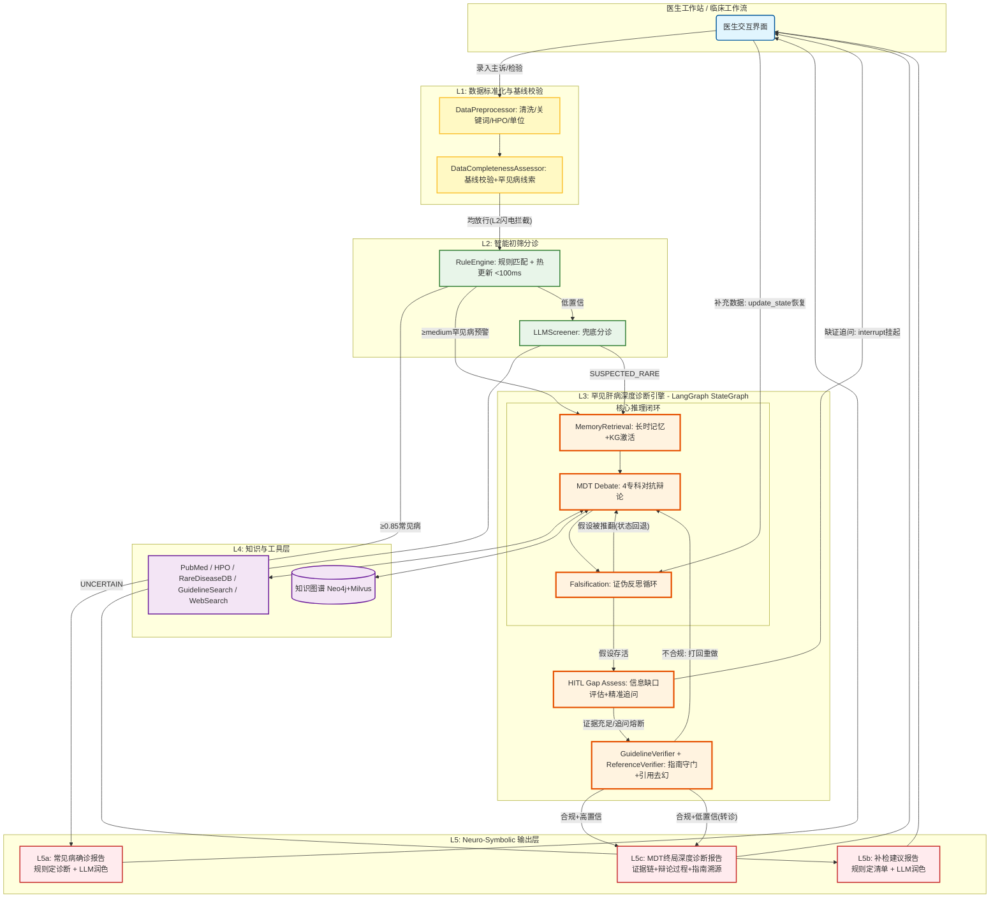

# Medical-Agent 医疗多智能体诊断系统

> 基于五层架构的基层医院肝病辅助诊断系统，融合 DeepRare + MAGIC + LangGraph

***

## 📋 项目简介

Medical-Agent 是一款专为基层医院设计的罕见肝病辅助诊断系统。该系统融合 DeepRare、MAGIC 与 RareAgents 的核心机制，基于 LangGraph 状态机编排，构建了一个具备对抗性推理、可证伪验证、强溯源能力、带记忆功能、会主动追问、知进退的多智能体诊断系统。

### 系统概述

在基层医院，罕见肝病的诊断面临着三大挑战：

1. **表型迷雾**：症状复杂多变，难以识别
2. **首诊信息不全**：病历信息极度缺失
3. **医生经验局限**：罕见病诊断经验不足

传统的医疗 AI 多为被动接收数据的"离线判读工具"，在信息残缺时极易产生幻觉或给出无临床价值的结论。

Medical-Agent 旨在打破这一僵局，实现从"被动判读"到"主动推理"的代际跃升。系统深度融汇了：

- **DeepRare** 的可溯源证伪机制
- **MAGIC** 的辩论驱动图推理
- **RareAgents** 的多专科对抗机制

构建了以动态记忆为先验、以专科认知偏误对抗为核心、以假设-证伪为闭环的深度推理引擎。

更重要的是，系统直面基层临床现实，通过从 L1 基线拦截到 L3 精准追问再到 L5 兜底指引的全链路信息缺口闭环，真正成为基层医生得心应手的"数字同事"——不仅能给出锚定真实文献的硬核诊断，更懂得在迷茫时主动索要关键证据，在力所不及时给出明确的检查与转诊方向。

***

## 🌟 核心特性

### 一、推理范式革新：从单线顺应到对抗求真

| 特性                          | 描述                                                                                    |
| --------------------------- | ------------------------------------------------------------------------------------- |
| ⚔️ **角色驱动与偏误对抗**            | 摒弃传统的模态流水线，构建带"认知偏误"的专科 Agent 池（肝病/神经/风湿/血液）。通过强制交叉质证，利用观点冲突撕开罕见病的伪装，打破单 LLM 推理的确认偏误。 |
| 🔍 **假设-证伪反思闭环**            | 变"盲目重试"为"主动证伪"。系统主动搜寻排他性反例推翻错误假设，并依托 LangGraph 的状态回退边，彻底阻断死胡同，实现逻辑上的推倒重来。             |
| 🧩 **辩论驱动图推理 (MAGIC EWAS)** | 辩论结果不再仅是文本，而是作为先验信号，通过确定性算法（EWAS）动态更新知识图谱的节点/边权重，让静态图谱在推理中"活"起来，精准激活诊断路径。             |

### 二、知识溯源与增强：拒绝幻觉，拥抱先验

| 特性                | 描述                                                                          |
| ----------------- | --------------------------------------------------------------------------- |
| 🧠 **动态长时记忆先验**   | 纵向提取患者跨周期病史趋势，横向检索群体级相似罕见病例，为 MDT 辩论提供"类比推理"的直觉先验，有效打破罕见病诊断的冷启动魔咒。          |
| 🔗 **硬证据锚定与双重去幻** | 强制执行"无检索不推理"，所有论据必须绑定真实外部源。独创引用去幻校验器，执行 URL 格式校验与语义一致性双重校验，彻底剔除大模型幻觉链接与断章取义。 |

### 三、临床工作流深度适配：全链路信息缺口闭环

| 特性                  | 描述                                                                                                 |
| ------------------- | -------------------------------------------------------------------------------------------------- |
| 🛡️ **三层主动获取与追问机制** | 完美契合基层不全病历现状。L1 基线校验拦截"无米之炊"；L3 鉴别追问（HITL）基于竞争假设精准索要证据（限2轮防骚扰）；L2/L5 兜底指引在分诊僵局或确诊无力时，输出明确的下一步检查方向。 |

### 四、医疗安全与合规底线：知进退，守规矩

| 特性               | 描述                                                                                                |
| ---------------- | ------------------------------------------------------------------------------------------------- |
| 🛡️ **指南守门强校验**  | 诊断输出前，强制过审 AASLD/EASL 指南必需条件，不符合临床规范的结论坚决打回重做，杜绝大模型"自圆其说"。                                        |
| 🏥 **基层可及性极致过滤** | 深刻理解基层医疗约束。系统输出的检查建议自动经过基层可及性知识库过滤，遇不可及项目（如肝穿刺/全外显子）自动降级为替代方案（如 FibroScan/热点筛查）或直接生成转诊建议，绝不开空头支票。 |

***

## 🏗️ 五层系统架构

```text
┌─────────────────────────────────────────────────────────────────────────────┐
│ 【L1: 数据标准化与基线校验】 (规则驱动，确保运转底线)                           │
│ • 文本清洗、正则关键词提取、HPO 术语映射、单位标准化（5 种跨单位转换）           │
│ • 数据完备度评分 (0-1)：识别缺失关键指标，检测罕见病线索（统一放行至 Triage）    │
└─────────────────────────────────────────────────────────────────────────────┘
                                    ↓ (统一放行)
┌─────────────────────────────────────────────────────────────────────────────┐
│ 【L2: 智能初筛分诊模块】 (规则引擎 < 100ms + LLM 兜底)                          │
│ • RuleEngine：11 种肝病 YAML 规则，11 种运算符，动态分母加权，热更新              │
│ • 三层拦截：极高置信度常见病 (≥0.85) → L5a / 高置信罕见病预警 (≥medium) → L3 / 边缘疑似 → LLM 兜底   │
│ • 🛑 LLMScreener 兜底 (数据不足时生成补检建议，进入 L5b)                        │
└─────────────────────────────────────────────────────────────────────────────┘
                                    ↓ (判定为疑似罕见病)
┌─────────────────────────────────────────────────────────────────────────────┐
│ 【L3: 罕见肝病深度诊断层】 (LangGraph StateGraph + Neuro-Symbolic 中间件)      │
│                                                                             │
│  1. 动态长时记忆检索 (纵向病史 + 横向相似病例 + KG 候选疾病激活)                 │
│                           ↓                                                 │
│  2. 动态组队 (MDTManager 按需从 4 大专科 Agent 池 + 7 功能 Agent 唤醒角色)      │
│                           ↓                                                 │
│  3. 基于认知偏误的对抗辩论 (FIPA-ACL 精简协议，强制引用 L4 真实文献与先验)        │
│                           ↓                                                 │
│  ┌─────────────────────────────────────────────────────────────────────┐    │
│  │ 4. 鉴别信息缺口评估与精准追问 (HITL 挂起) ⭐核心认知层                   │    │
│  │    • 基于竞争假设识别关键缺证（4 级优先级：CRITICAL/HIGH/MEDIUM/LOW）     │    │
│  │    • LangGraph interrupt 挂起状态机                                    │    │
│  │    • 医生补充新事实后 checkpoint + thread_id 断点恢复                    │    │
│  └─────────────────────────────────────────────────────────────────────┘    │
│                           ↓                                                 │
│  5. 证伪反思循环 (主动搜寻排他证据，contradiction_score ≥ 0.6 触发硬排除回退)    │
│                           ↓                                                 │
│  6. 指南守门员 & 引用去幻校验器 (强制比对 AASLD/EASL，URL格式+语义双重去幻)      │
│                           ↓                                                 │
│  7. 转诊决策 (ReferralDeciderAgent 评估转诊必要性/科室/紧急程度)               │
└─────────────────────────────────────────────────────────────────────────────┘
                                    ↓
┌─────────────────────────────────────────────────────────────────────────────┐
│ 【L4/L5: Neuro-Symbolic 知识库与输出层】 (规则定乾坤，LLM 写医嘱)               │
│ • L4: KGInterface (Neo4j+Milvus 三级降级) + 7 个诊断工具 + LLM 客户端管理       │
│ • L5a 常见病确诊：规则定诊断 + LLM 临床推理润色 (CommonDiagnosisReport)        │
│ • L5b 补检建议：规则定补检清单 + LLM 临床分析润色 (TriageRecommendationReport)  │
│ • L5c MDT 终局：证据链 + 辩论过程 + 证伪日志 + 指南溯源 (MDTFinalReport)       │
└─────────────────────────────────────────────────────────────────────────────┘
```

<br />

### 架构流程说明

1. **L1 层 - 数据标准化与基线校验**
   - DataPreprocessor：正则文本清洗、症状结构化、检验指标单位统一（5种跨单位转换）、缺失值标记
   - HPOExtractor：中文症状→HPO 标准术语映射（33 条中文术语映射，RapidFuzz 模糊匹配，LLM 提取+规则降级双路径）
   - DataCompletenessAssessor：完备度评分(0-1)、识别 missing_critical / missing_recommended、检测罕见病线索（有罕见线索即使数据不足也放行至 Triage）
   - **关键设计**：即使数据不足也不在 L1 直接拦截，而是放行到 L2 Triage，由 Triage 内部的"闪电拦截"机制处理
2. **L2 层 - 智能初筛分诊模块**
   - RuleEngine：11 种肝病 YAML 规则（6 罕见+5 常见），11 种运算符（`>/</>=/<=/==/!=/contains/startswith/endswith/has_recent_medication/within_days`），动态分母加权评分，响应 < 100ms
   - 三层拦截策略：极高置信度常见病 (≥0.85) → 直接路由 L5a 确诊报告；高/中置信罕见病预警 (≥medium, score≥0.5) → L3 深度诊断；低置信罕见病降级为随访建议
   - LLMScreener：LLM 兜底评估非典型/边界病例，输出 LIKELY_COMMON / SUSPECTED_RARE / UNCERTAIN 三级分类
   - 闪电拦截机制：数据评估短路——数据严重不足且无罕见病线索时，跳过规则引擎与 LLM，直接返回补检建议
   - 规则热更新：基于文件修改时间哈希检测 `rules/*.yaml` 变更，自动调用 `load_rules(force=True)`，无需重启服务
3. **L3 层 - 罕见肝病深度诊断（LangGraph 编排）**
   - **Memory Retrieval**：纵向提取患者跨周期病史趋势 + 横向检索相似病例 + KG 候选疾病激活
   - **MDT Team Assemble**：MDTManager 根据症状/检验异常动态选择 ≥2 个相关专科 Agent
   - **MDT Debate**：4 专科 Agent 并行分析 (asyncio.gather) → DebateMediator 两轮对抗辩论 (PROPOSE→交叉质证) → 共识达成
   - **Falsification**：FalsificationEngine 主动检索排他性反例 (KG CONTRADICTS 关系优先)，`contradiction_score ≥ 0.6` 触发证伪并回退至 mdt_debate
   - **HITL Gap Assess**：InformationGapAssessor 基于竞争假设识别关键缺证，CRITICAL 级问题触发 LangGraph interrupt 挂起等待医生补充数据
   - **Guideline Verify**：GuidelineVerifier 强制比对 AASLD/EASL 指南必需条件 + ReferenceVerifier 引用去幻（URL 格式+语义一致性双重校验）
   - **Neuro-Symbolic 分离**：上述所有步骤均为确定性规则/算法执行，LLM 仅参与 4 个限定场景且无权改变诊断结论
4. **L4 层 - 知识库与工具层**
   - 7 个诊断工具：HPOExtractor / HPOSearchTool / PubMedSearchTool / RareDiseaseDBTool / GuidelineSearchTool / WebSearchTool / AdaptiveCaseClassifier
   - KGInterface：整合 Neo4j（图数据库）+ Milvus（向量数据库），三级降级（Neo4j+Milvus → Milvus Only → LLM 降级）
   - Feature Flag 控制 4 个 KG 集成点独立开关，支持渐进式上线
5. **L5 层 - Neuro-Symbolic 输出层**
   - L5a 常见病确诊报告：规则定诊断 + LLM 临床推理润色（CommonDiagnosisReport）
   - L5b 补检建议报告：规则定补检清单 + LLM 临床分析润色（TriageRecommendationReport）
   - L5c MDT 终局深度诊断报告：证据链 + 辩论过程 + 证伪日志 + 指南溯源（MDTFinalReport）
   - 基层可及性过滤器：不可及检查自动降级为替代方案或转诊建议
   - 临床评分系统：FIB-4 / Child-Pugh / MELD

***

## 📁 项目结构

```text
Rare-Hepatic-Disease-Multi-Agent-System/
├── README.md
├── requirements.txt
├── setup.py
├── config.yaml
├── agents/                          # 多智能体层（主治 + 专科）
│   ├── attending_agent.py
│   ├── diagnostic_reasoner.py
│   ├── history_collector_v2.py
│   ├── imaging_analyzer.py
│   ├── knowledge_retriever.py
│   ├── lab_interpreter.py
│   ├── referral_decider.py
│   └── specialist_agents/
│       ├── hepatologist.py
│       ├── neurologist.py
│       ├── rheumatologist.py
│       └── hematologist.py
├── api/                             # FastAPI 接口
│   ├── main.py
│   ├── dependencies.py
│   ├── schemas.py
│   ├── routes.py
│   └── routers/
│       ├── diagnosis.py
│       ├── hitl.py
│       └── feedback.py
├── core/                            # 编排与推理核心
│   ├── graph_orchestrator.py        # LangGraph StateGraph 主流程
│   ├── state_definition.py          # 全局状态定义
│   ├── preprocessor.py              # L1 预处理
│   ├── data_assessor.py             # L1 数据完整度评估
│   ├── triage.py                    # L2 规则+LLM 分诊
│   ├── mdt_manager.py               # L3 MDT 团队管理
│   ├── scoring_system.py            # 临床评分 (FIB-4/Child-Pugh/MELD)
│   ├── llm_client.py                # LLM 客户端管理 (DashScope/OpenAI)
│   ├── rule_watcher.py              # 规则文件变更监控
│   ├── evidence_chain.py            # 证据链管理
│   ├── reflection_engine.py         # 反思引擎
│   ├── medical_middleware/
│   │   ├── memory_retriever.py      # 长时记忆检索
│   │   ├── information_gap_assessor.py  # 信息缺口评估+精准追问
│   │   ├── debate_mediator.py       # FIPA-ACL 对抗辩论协调
│   │   ├── falsification.py         # 证伪引擎
│   │   ├── guideline_verifier.py    # 指南守门员
│   │   └── reference_verifier.py    # 引用去幻校验器
│   └── kg/                          # 知识图谱子系统
│       ├── kg_interface.py          # 统一查询API + 三级降级
│       ├── kg_config.py             # KG 配置管理
│       ├── kg_schema.py             # 数据模型定义
│       ├── kg_builder.py            # 图谱构建
│       ├── kg_retriever.py          # 图谱检索
│       ├── kg_classifier.py         # 候选疾病分类
│       ├── kg_embedder.py           # 向量嵌入
│       ├── kg_differential.py       # 差异诊断
│       ├── kg_validator.py          # 图谱校验
│       ├── kg_writer.py             # 图谱写入
│       ├── kg_importer.py           # 数据导入
│       ├── kg_extractor.py          # 实体抽取
│       ├── kg_chunker.py            # 文本分块
│       ├── kg_cleaner.py            # 数据清洗
│       ├── kg_cache.py              # 查询缓存
│       ├── kg_review.py             # 图谱审核
│       └── diseases/                # 疾病知识管线
│           └── disease_pipeline.py
├── tools/                           # L4 检索/知识工具
│   ├── adaptive_classifier.py
│   ├── guideline_search.py
│   ├── hpo_extractor.py
│   ├── hpo_search.py
│   ├── pubmed_search.py
│   ├── rare_disease_db.py
│   └── web_search.py
├── rules/                           # 分诊规则与字段映射
│   ├── common_diseases.yaml
│   ├── rare_diseases.yaml
│   └── field_test_mapping.yaml
├── frontend/                        # 前端工作站
├── tests/                           # 单元/病例测试与结果
├── docs/                            # 架构/API 文档
└── scripts/                         # Demo 与辅助脚本
```

***

## 📐 模块级设计架构详解

### L1 层 - 数据标准化与基线校验

#### 1.1 核心组件

| 组件 | 实现位置 | 功能说明 |
| --- | --- | --- |
| **DataPreprocessor** | `core/preprocessor.py` | 统一预处理入口：正则文本清洗、症状结构化、检验指标单位统一（mg/dL↔μmol/L 等）、缺失值标记，输出标准化 PatientData |
| **DataCompletenessAssessor** | `core/data_assessor.py` | 数据完备度评估：计算评分(0-1)、输出 SUFFICIENT/INSUFFICIENT 等级、识别 missing_critical 与 missing_recommended、检测罕见病线索（罕见病线索即使数据不足也放行进入 Triage） |
| **HPOExtractor** | `tools/hpo_extractor.py` | 中文症状→HPO 标准术语映射：支持 33 条中文术语映射，RapidFuzz 模糊匹配（相似度阈值 80%），LLM 提取+规则降级双路径 |

#### 1.2 支持的单位转换

| 指标 | 单位 A | 单位 B | 转换系数 (A→B) |
| --- | --- | --- | --- |
| 总胆红素 (TBil) | mg/dL | μmol/L | × 17.1 |
| 直接胆红素 (DBil) | mg/dL | μmol/L | × 17.1 |
| 白蛋白 (Albumin) | g/dL | g/L | × 10.0 |
| 铜蓝蛋白 (Ceruloplasmin) | mg/L | g/L | × 0.001 |
| 铁蛋白 (Ferritin) | ng/mL | μg/L | × 1.0 |

#### 1.3 处理流程

```text
原始输入 → DataPreprocessor（文本清洗+HPO提取+单位标准化） → DataCompletenessAssessor（基线校验+罕见病线索检测） → L2 Triage
```

**关键设计**：DataCompletenessAssessor 即使判定数据不足，也会放行到 Triage。Triage 内部有"闪电拦截"机制——数据严重不足时快速返回补检建议，不会启动重型诊断引擎。

***

### L2 层 - 智能初筛分诊模块

**设计理念**：双层分诊架构——规则引擎覆盖确定性病例（毫秒级响应），LLM 兜底处理非典型/边界病例。遵循 Neuro-Symbolic AI 原则：规则定分诊，LLM 仅作补充。

#### 2.1 RuleEngine — 规则引擎（快速通道）

| 特性 | 说明 |
| --- | --- |
| **覆盖疾病** | 常见病 5 种（脂肪肝、酒精肝、DILI、病毒性肝炎、肝硬化）+ 罕见病 6 种（Wilson 病、AIH、PBC、血色病、AAT 缺乏症、PSC） |
| **响应时间** | 常见病 < 50ms，罕见病 < 100ms |
| **评分机制** | 动态分母加权：仅对患者已提供的字段计算满分，避免缺失字段拉低置信度（分母 = 已提供 core_rules 权重之和，而非全部规则权重） |
| **运算符** | 支持 11 种：`>` / `<` / `>=` / `<=` / `==` / `!=` / `contains` / `startswith` / `endswith` / `has_recent_medication` / `within_days`（注：`within_days` 尚未完整实现） |
| **热更新** | 基于文件修改时间哈希检测 `rules/*.yaml` 变更，自动调用 `load_rules(force=True)`，无需重启服务 |
| **实现文件** | `core/triage.py` — RuleEngine + IntelligentTriage，`rules/common_diseases.yaml` + `rules/rare_diseases.yaml` |

**三层拦截策略**：

```
规则引擎匹配
  ├─ 极高置信度常见病 (≥0.85) → 直接路由 common_fast_path → 确诊报告 (L5a)
  ├─ 高/中置信罕见病预警 (≥medium, score≥0.5) → 路由 rare_deep_path → L3 深度诊断
  ├─ 低置信罕见病降级处理 → 降级为随访建议
  └─ 核心条件 UNKNOWN → 状态 PENDING，记录缺失指标
                              │
                              ▼
                     缺口分析 → 生成检查建议 → HITL 挂起返回补检建议 (L5b)
```

#### 2.2 LLMScreener — LLM 兜底分诊

当规则引擎无法确定时（非典型/边界病例），触发 LLM 进行结构化评估：

- **输入**：L1 标准化患者数据（仅事实，不传诊断建议）
- **输出**：三级分类 — `LIKELY_COMMON`（常见病快速通道）/ `SUSPECTED_RARE`（罕见病深度诊断）/ `UNCERTAIN`（信息不足，生成检查建议）
- **容灾**：LLM 超时 30s、JSON 解析失败、或异常时，自动降级为规则引擎兜底结果
- **安全约束**：LLM Prompt 限定"仅基于已有事实分类，不得给出诊断结论"

#### 2.3 AdaptiveCaseClassifier — 病例复杂度分级

| 复杂度 | 触发条件 | 处理策略 |
| --- | --- | --- |
| SIMPLE | 单一系统受累 + 典型表现 | 常见病快速通道 |
| MODERATE | 多系统轻度受累 | 标准 L3 流程 |
| COMPLEX | 多系统显著受累 + 非典型表现 | 全专科 MDT 辩论 + 多轮证伪 |

**配置示例**（`rules/rare_diseases.yaml`）：

```yaml
wilson_disease:
  core_rules:
    ceruloplasmin:
      operator: lt
      value: 0.1
      weight: 3
    kayser_fleischer_ring:
      operator: eq
      value: true
      weight: 3
  supporting_rules:
    neurological_symptoms:
      operator: in
      value: ["震颤", "构音障碍", "肌张力障碍"]
      weight: 1
  output:
    diagnosis: "肝豆状核变性 (Wilson病)"
    urgency: "urgent"
```

***

### L3 层 - 罕见肝病深度诊断（LangGraph 编排）

**设计理念**：Neuro-Symbolic AI 架构——规则引擎与中间件负责确定性诊断逻辑（不可被 LLM 篡改），LLM 仅负责临床语言润色。LangGraph StateGraph 实现 14 节点 4 条件边的状态机编排，核心推理闭环为「辩论→证伪→HITL 补证→指南守门」。

#### 3.1 LangGraph 状态定义

**DiagnosticState 状态字段说明：**

| 字段类别 | 字段名 | 类型 | 合并策略 | 说明 |
| --- | --- | --- | --- | --- |
| 患者数据 | `patient_data` | PatientData | merge_patient_data（深度合并） | 原始患者输入与后续补充数据的合并载体 |
| 数据评估 | `data_assessment_result` | DataAssessmentResult | 覆盖 | L1 数据完备度评估输出 |
| 分诊结果 | `triage_result` | TriageResult | 覆盖 | L2 分诊结论与路由方向 |
| 诊断假设 | `hypotheses` | List[DiagnosticHypothesis] | operator.add（追加） | MDT 辩论产生的候选假设列表 |
| 辩论状态 | `debate_state` | DebateState | 覆盖 | 辩论过程记录（轮次/消息/共识/分歧） |
| 证伪日志 | `falsification_log` | List[FalsificationEntry] | operator.add（追加） | 每次证伪的结果记录 |
| HITL 状态 | `hitl_status` | str | 覆盖 | normal / interrupted / resumed |
| HITL 问题 | `hitl_questions` | List[Question] | 覆盖 | 挂起时返回医生的追问列表 |
| 排除假设 | `excluded_hypotheses` | List[str] | operator.add（追加） | 被证伪引擎排出的疾病名 |
| 指南校验 | `guideline_check_result` | GuidelineCheckEntry | 覆盖 | 指南守门员校验输出 |
| 记忆上下文 | `memory_context` | Dict | 覆盖 | 纵向病史摘要 + 横向相似病例 + KG 差异上下文 |
| KG 检索 | `kg_retrieval_result` | Dict | 覆盖 | 知识图谱检索结果（候选疾病+降级等级） |
| 转诊决策 | `referral_decision` | Dict | 覆盖 | 转诊必要性/推荐科室/紧急程度 |
| 最终报告 | `final_report` | FinalReport | 覆盖 | 三种报告类型之一 |
| 流程控制 | `current_phase` / `retry_count` / `errors` | str / int / List | 覆盖/覆盖/add | 执行阶段追踪、重试计数、错误日志 |

**合并策略说明**：
- `operator.add`（追加）：适用于列表语义字段，节点输出自动追加到已有列表
- `operator.ior`（合并）：适用于字典语义字段，节点输出自动合并到已有字典
- 覆盖语义：适用于单值字段，后续节点输出直接替换前值
- `merge_patient_data`（自定义深度合并）：患者数据嵌套字典合并（如 labs 子字段增量更新）

#### 3.2 LangGraph 节点与数据流

**完整诊断流程图：**



**LangGraph 节点说明：**

| 节点 | 所属层 | 函数 | 功能描述 |
| --- | --- | --- | --- |
| `preprocessing` | L1 | `_node_preprocessing` | DataPreprocessor：正则文本清洗、症状结构化、HPO 术语提取、单位标准化 |
| `data_assessment` | L1 | `_node_data_assessment` | DataCompletenessAssessor：完备度评分(0-1)、罕见病线索检测 |
| `triage` | L2 | `_node_triage` | IntelligentTriage：规则匹配(11种疾病)+LLM兜底+三层拦截路由 |
| `common_fast_path` | L2→L5 | `_node_common_fast_path` | 常见病快速路径预处理 |
| `memory_retrieval` | L3 | `_node_memory_retrieval` | MemoryRetriever检索纵向病史+横向相似病例；KGInterface检索候选疾病并激活子图 |
| `mdt_team_assemble` | L3 | `_node_mdt_team_assemble` | MDTManager动态组队，按症状/检验异常选择相关专科 Agent |
| `mdt_debate` | L3 | `_node_mdt_debate` | 并行执行专科分析(asyncio.gather) → DebateMediator两轮对抗辩论(PROPOSE→交叉质证) → 提取共识 |
| `falsification` | L3 | `_node_falsification` | FalsificationEngine主动检索排他性反例，矛盾分数≥0.6 触发证伪，硬排除而非软抑制 |
| `hitl_gap_assess` | L3 | `_node_hitl_gap_assess` | InformationGapAssessor基于竞争假设识别关键缺证，CRITICAL 级触发 interrupt 挂起 |
| `guideline_verify` | L3 | `_node_guideline_verify` | GuidelineVerifier强制比对AASLD/EASL指南必需条件+ReferenceVerifier引用去幻 |
| `referral_decision` | L3→L5 | `_node_referral_decision` | ReferralDeciderAgent评估转诊必要性/推荐科室/紧急程度 |
| `common_disease_report` | L5a | `_node_common_disease_report` | 常见病确诊报告：规则定诊断+LLM润色临床推理(L5专属出口①) |
| `triage_examination_report` | L5b | `_node_triage_examination_report` | 补检建议报告：规则定检查清单+LLM润色临床分析(L5专属出口②) |
| `mdt_final_report` | L5c | `_node_mdt_final_report` | MDT终局报告：证据链+辩论过程+证伪日志+指南溯源(L5专属出口③) |

**条件分支逻辑（4 条条件边）：**

```text
triage（条件边1: _route_after_triage）
  ├─ common_fast_path → common_disease_report (L5a 常见病确诊报告)
  ├─ rare_deep_path → memory_retrieval (进入 L3 深度诊断)
  └─ uncertain_fallback → triage_examination_report (L5b 补检建议报告)

falsification（条件边2: _route_after_falsification）
  ├─ 假设被证伪 + retry_count < 2 → mdt_debate（回退重新辩论）
  └─ 假设存活 / 重试达上限 → hitl_gap_assess

hitl_gap_assess（条件边3: _route_after_hitl）
  ├─ hitl_status == interrupted → END（LangGraph interrupt 挂起，等待医生补充数据）
  └─ hitl_status == normal → guideline_verify

guideline_verify（条件边4: _route_after_guideline）
  ├─ 不合规 → mdt_debate（打回重做）
  └─ 合规 → referral_decision → mdt_final_report (L5c MDT终局报告)
```

#### 3.3 Neuro-Symbolic AI 架构

本系统的核心设计原则：

```
┌────────────────────────────────────────────────────────────┐
│              Neuro-Symbolic AI 职责分离                      │
│                                                            │
│  ┌──────────────────────┐    ┌──────────────────────┐      │
│  │  符号层 (Symbolic)    │    │  神经层 (Neural)      │      │
│  │  确定性，不可被LLM篡改  │    │  仅限4个限定场景       │      │
│  ├──────────────────────┤    ├──────────────────────┤      │
│  │ ✓ RuleEngine 分诊    │    │ ✓ 分诊兜底评估        │      │
│  │ ✓ 专科Agent规则诊断   │    │ ✓ 常见病报告润色      │      │
│  │ ✓ FalsificationEngine│    │ ✓ 补检建议润色        │      │
│  │ ✓ GuidelineVerifier  │    │ ✓ HITL追问生成       │      │
│  │ ✓ 临床评分(FIB-4等)   │    │                      │      │
│  │ ✓ 转诊决策逻辑       │    │  ⚠️ LLM无权改变        │      │
│  │ ✓ 诊断结论确定       │    │    诊断结论!            │      │
│  └──────────────────────┘    └──────────────────────┘      │
│                                                            │
│  LLM三层容灾：                                              │
│  ① asyncio.wait_for 超时30s → 降级                         │
│  ② JSON解析失败(Markdown代码块提取) → 降级                   │
│  ③ 异常 Exception → 降级为规则引擎报告                       │
└────────────────────────────────────────────────────────────┘
```

#### 3.4 MDT Manager 动态组队

**4 专科 Agent 矩阵：**

| Agent | 文件 | 专科领域 | 认知偏误声明(bias_description) | 诊断逻辑 |
| --- | --- | --- | --- | --- |
| HepatologistAgent | `agents/specialist_agents/hepatologist.py` | 肝病专科 | "倾向从肝脏本身解释所有症状，忽视肝外表现" | 铜蓝蛋白阈值判断Wilson、ANA+IgG判断AIH、AMA-M2判断PBC |
| NeurologistAgent | `agents/specialist_agents/neurologist.py` | 神经专科 | "倾向将所有运动障碍归因于原发神经疾病" | 震颤类型分析、认知障碍检测、K-F环与Wilson关联 |
| RheumatologistAgent | `agents/specialist_agents/rheumatologist.py` | 风湿专科 | "倾向将多系统受累归因于系统性自身免疫病" | 自身抗体谱解读、关节炎模式识别、干燥综合征排除 |
| HematologistAgent | `agents/specialist_agents/hematologist.py` | 血液专科 | "倾向从血液系统异常解释肝脏表现" | 凝血异常分析、铁代谢评估、血细胞减少鉴别 |

**动态组队逻辑**：MDTManager 根据患者症状与检验异常自动选择 ≥2 个相关专科 Agent，通过 `asyncio.gather(*tasks, return_exceptions=True)` 并行执行分析，单 Agent 故障不阻塞整体流程。

**7 个功能 Agent**：AttendingAgent（主治协调）、DiagnosticReasoner（诊断推理）、HistoryCollectorV2（病史采集）、LabInterpreter（检验解读）、ImagingAnalyzer（影像分析）、KnowledgeRetriever（知识检索）、ReferralDecider（转诊决策）。

#### 3.5 对抗辩论引擎

**基于 FIPA-ACL 精简协议的辩论机制：**

| 辩论阶段 | 说明 | FIPA-ACL 消息类型 |
| --- | --- | --- |
| 1. 观点提出 | 各专科 Agent 基于自身认知偏误视角提出初始诊断假设 | PROPOSE |
| 2. 交叉质证 | Agent 之间相互质疑，提出反驳论据，强制引用外部证据 | REJECT / QUERY / INFORM |
| 3. 共识达成 | ≥2 专科支持的形成共识，按支持专科数→平均置信度排序 | ACCEPT / AGREEMENT |

**辩论配置**：

| 属性 | 说明 |
| --- | --- |
| 辩论轮次 | 两轮对抗辩论（Round 1: PROPOSE 各自陈述 → Round 2: 交叉质证/共识识别），`max_rounds` 可配置（默认 3） |
| 协议 | FIPA-ACL 精简协议：PROPOSE → QUERY(质疑) / AGREEMENT(同意) / CHALLENGE(反驳) → CONSENSUS(共识) |
| 共识机制 | 所有活跃 Agent 均发出 AGREEMENT → 自动达成共识；否则由 Mediator 强制裁决 |
| 认知偏误防护 | 锚定效应（首诊印象锁定）→ 强制证伪；确认偏误（只搜支持证据）→ 交叉质证；过早闭合（忽略竞争假设）→ 信息缺口评估 |
| 实现文件 | `core/medical_middleware/debate_mediator.py` |

**核心特性**：
- 每个专科 Agent 显式声明认知偏误，辩论协调器利用偏误差异驱动对抗推理
- 强制引用真实外部文献（L4 知识库），拒绝空口无凭的论断
- 支持多轮辩论（最多 3 轮），记录完整辩论日志用于溯源
- KG 集成：通过 `integration.debate_context` Feature Flag 控制 KG 差异上下文的注入

#### 3.6 证伪反思循环

**主动证伪机制**（`core/medical_middleware/falsification.py`）：

| 步骤 | 操作 | 输出 |
| --- | --- | --- |
| 1. 反例检索 | 基于当前假设，检索排他性证据（KG CONTRADICTS 关系优先，降级到疾病特异性硬编码规则） | 排他性证据列表 |
| 2. 矛盾验证 | `contradiction_score = min(1.0, len(contradicting_evidence) × 0.3)`，阈值 0.6 | 矛盾程度评分 |
| 3. 硬排除 | 证伪的假设加入 `excluded_hypotheses`（硬排除，非软抑制），触发 LangGraph 条件边回退至 mdt_debate | 返回上一状态 |

**与假设置信度的区分**：
- `hypotheses.confidence`：MDT 辩论达成的正向置信度（多维连续值）
- `excluded_hypotheses`：证伪排除的假设（二元判定，已排除/未排除）
- 证伪 = 硬排除而非软抑制：一旦被证伪，该假设不再参与后续辩论和检索

#### 3.7 知识图谱权重管理

**设计决策**：辩论结果不修改全局知识图谱权重。系统通过 `hypotheses.confidence`（正向置信度）+ `excluded_hypotheses`（证伪排除）管理患者级假设状态，无需额外图权重机制。KG 结构和权重保持静态不变（遵循 P5-MedGraphRAG 的 RepoGraph 设计哲学）。未来如接入 Neo4j 图数据库，图更新仅限于全局知识新增（人工审核），单次诊断会话仅影响患者级假设状态。

**KG 集成 Feature Flag 控制**：

| Feature Flag | 控制目标 | KG 可用时 | 降级路径 |
| --- | --- | --- | --- |
| `integration.falsification` | 证伪引擎 | KG CONTRADICTS 关系检索 | 硬编码 if-elif 规则 |
| `integration.guideline_verify` | 指南守门员 | KG GUIDED_BY 关系 + Feature 属性 | 硬编码字典 |
| `integration.info_gap` | 信息缺口评估器 | KG `get_info_gap_priority()` | 硬编码追问规则 |
| `integration.debate_context` | 辩论上下文注入 | KG 差异上下文（鉴别诊断关系） | 不注入 KG 上下文 |

***

### L4 层 - 知识库与工具层

#### 4.1 诊断工具链

| 工具 | 实现文件 | 功能说明 | 数据来源 |
| --- | --- | --- | --- |
| **HPOExtractor** | `tools/hpo_extractor.py` | 中文症状→HPO 标准术语映射，LLM 提取+规则降级双路径，RapidFuzz 模糊匹配（相似度阈值 80%） | 33 条中文术语映射表 |
| **HPOSearchTool** | `tools/hpo_search.py` | HPO 本体查询：按 HPO ID 检索疾病关联表型 | HPO Ontology (hp.obo) |
| **PubMedSearchTool** | `tools/pubmed_search.py` | 基于 NCBI E-utilities API 的文献检索，支持布尔逻辑、时间范围、文献类型筛选，结果缓存 | PubMed / NCBI E-utilities |
| **RareDiseaseDBTool** | `tools/rare_disease_db.py` | 内置 5 种罕见肝病完整知识：Wilson 病、AIH、PBC、血色病、AAT 缺乏症（含 Orphanet ID/OMIM ID/致病基因/流行率/关键症状/诊断检查/治疗方案） | Orphanet / OMIM |
| **GuidelineSearchTool** | `tools/guideline_search.py` | 内置 4 种疾病诊疗指南（Wilson/AIH/血色病/PBC），含中英文双语版本，支持必需条件+支持条件检索 | AASLD / EASL 指南 |
| **WebSearchTool** | `tools/web_search.py` | 通用 Web 搜索工具，扩展信息获取边界 | Web 数据源 |
| **AdaptiveCaseClassifier** | `tools/adaptive_classifier.py` | 病例复杂度自适应分级：SIMPLE/MODERATE/COMPLEX，影响后续 MDT 组队策略 | 规则驱动 |

#### 4.2 知识图谱接口（KGInterface）

**架构**：整合 Neo4j 图数据库（结构化关系查询）与 Milvus 向量数据库（语义相似度检索），实现三级降级策略。

| 层级 | 状态 | 功能 | 降级触发条件 |
| --- | --- | --- | --- |
| L0: Neo4j + Milvus | 全功能 | 向量粗排 → 图扩展 → 候选疾病 → 差异诊断 → 指南溯源 | 默认状态 |
| L1: Milvus Only | 部分降级 | 向量检索 Top-K 候选疾病，无图扩展 | Neo4j 不可用 |
| L2: LLM 降级 | 紧急降级 | LLM 替代知识检索（兜底，不推荐用于诊断决策） | Neo4j + Milvus 均不可用 |

**检索链路**：
```text
患者数据 → HPO 特征向量化 → Milvus ANN 粗排 → Neo4j 图扩展（疾病-表型-基因-指南子图）
→ 候选疾病列表 → 差异诊断 KG 搜索 → 指南溯源（GUIDED_BY 关系）
```

#### 4.3 引用去幻校验器

**双重校验机制**（`core/medical_middleware/reference_verifier.py`）：

| 校验类型 | 方法 | 阈值 | 处理方式 |
| --- | --- | --- | --- |
| URL 格式校验 | 正则匹配 HTTP/HTTPS/DOI/PMID 格式 | — | 格式无效则剔除 |
| 语义一致性 | 词汇重叠率：`len(交集词) / max(len(text词), len(claimed词))` | 0.6 | 低于阈值则标记为不可靠 |

#### 4.4 LLM 客户端管理

**多 Provider 支持**（`core/llm_client.py`）：

| Provider | 优先级 | 配置来源 |
| --- | --- | --- |
| DashScope | 1st | `.env` 环境变量（DASHSCOPE_API_KEY 等）|
| OpenAI | 2nd | `.env` 环境变量（OPENAI_API_KEY 等）|
| DeepSeek | 3rd | `config.yaml` 配置文件 |

**关键设计**：
- 全局客户端缓存：以 `config_path:temperature:max_tokens` 为键，避免重复实例化
- LLM 使用严格限定为 4 个场景：分诊兜底 / 报告润色 / 补检建议润色 / HITL 追问生成
- 三层容灾：超时 30s 降级 → JSON 解析失败降级（Markdown 代码块提取）→ 异常降级为规则报告

***

### L5 层 - Neuro-Symbolic 输出层

**设计理念**：三种专属诊断报告出口，职责严格分离。遵循 Neuro-Symbolic 原则——规则引擎确定核心结论（诊断/补检清单/转诊建议），LLM 仅负责临床语言润色（"规则定乾坤，LLM 写医嘱"）。

#### 5.1 三种报告类型

| 报告类型 | 出口节点 | 触发路径 | 核心内容 | 报告版本 |
| --- | --- | --- | --- | --- |
| **L5a: 常见病确诊报告** | `common_disease_report` | L2 极高置信度常见病 (≥0.85) → common_fast_path | 诊断结论 + 临床推理 + 随访计划 + 推荐复查项目 | `CommonDiagnosisReport` |
| **L5b: 补检建议报告** | `triage_examination_report` | L2 数据不足 / UNCERTAIN → uncertain_fallback | 缺失关键指标 + 补检清单（含每项检查目的） + 不确定性分析 | `TriageRecommendationReport` |
| **L5c: MDT 终局深度诊断报告** | `mdt_final_report` | L3 完整推理闭环 → guideline_verify 合规 → referral_decision | 诊断结论 + 鉴别诊断排序 + 辩论过程 + 证伪日志 + 指南溯源 + 转诊建议 + KG 激活结果 | `MDTFinalReport` |

#### 5.2 Neuro-Symbolic 报告生成流程

```
规则引擎确定核心结论（符号层，不可篡改）
  │
  ├─ L5a: diagnosis/confidence/urgency/follow_up_plan → 硬性事实
  ├─ L5b: missing_critical/missing_recommended/recommended_tests → 硬性事实
  └─ L5c: hypotheses/excluded_hypotheses/falsification_log/guideline_check → 硬性事实
                                │
                                ▼
                    LLM 临床语言润色（神经层，仅润色文本）
                      │
                      ├─ 成功 → report_version: llm_enhanced_v1
                      └─ 失败/超时/异常 → report_version: rule_based_v1（降级兜底）
                                │
                                ▼
                         结构化诊断报告输出
```

#### 5.3 基层可及性过滤器

**基层医疗约束过滤机制**：

| 不可及项目 | 降级替代方案 | 说明 |
| --- | --- | --- |
| 肝穿刺活检 | FibroScan 弹性成像 | 无创检查，基层可及 |
| 全外显子测序 | 热点基因筛查 | 成本降低，针对性更强 |
| 肝脏 MRI | 腹部超声 + CT | 基层医院常规设备 |
| 自身免疫抗体谱 | 核心抗体检测 | 优先检测关键指标 |

**过滤逻辑**：
1. 检查建议与基层可及性知识库比对
2. 不可及项目自动降级为替代方案
3. 无替代方案时生成转诊建议
4. 绝不开"空头支票"

#### 5.4 转诊建议生成

**转诊决策支持组件**：

| 输出项 | 说明 |
| --- | --- |
| 转诊必要性 | 基于诊断复杂度（COMPLEX 病例）和基层能力评估 |
| 推荐科室 | 肝病科 / 风湿免疫科 / 神经内科等 |
| 紧急程度 | 紧急 / 尽快 / 常规 |
| 转诊资料 | 需要携带的检查报告和病历摘要 |
| 注意事项 | 转诊途中的特殊注意事项 |

**决策依据**：诊断置信度 + 基层设备能力评估 + 专科医生 availability + 患者病情紧急程度。

#### 5.5 临床评分系统

| 评分工具 | 评估目标 | 输入指标 | 输出 |
| --- | --- | --- | --- |
| FIB-4 | 肝纤维化风险 | 年龄、ALT、AST、PLT | 纤维化风险等级 + 解读 |
| Child-Pugh | 肝硬化肝功能储备 | TBil、Alb、PT、腹水、肝性脑病 | A/B/C 分级 + 解读 |
| MELD | 终末期肝病预后 | TBil、Cr、INR、透析状态 | MELD 评分 + 90天生存率 |

***

## �� 快速开始

### 环境要求

- Python >= 3.9
- CUDA >= 11.8（如需 GPU 加速）

### 安装步骤

1. 克隆仓库
   ```bash
   git clone https://github.com/your-org/medical-agent.git
   cd medical-agent
   ```
2. 安装依赖
   ```bash
   pip install -r requirements.txt
   ```
3. 配置环境变量
   ```bash
   cp .env.example .env
   # 编辑 .env 文件，填入必要的 API 密钥和配置
   ```
4. 运行示例
   ```bash
   python examples/basic_diagnosis.py
   ```

***

## 📖 使用示例

### 基础诊断流程

```python
from medical_agent import MedicalAgent

# 初始化系统
agent = MedicalAgent(config_path="config.yaml")

# 输入患者数据
patient_data = {
    "symptoms": ["黄疸", "乏力", "食欲减退"],
    "lab_results": {
        "ALT": 120,
        "AST": 98,
        "TBIL": 45.2
    },
    "history": "无特殊病史"
}

# 执行诊断
result = agent.diagnose(patient_data)

# 输出结果
print(result.diagnosis)
print(result.confidence)
print(result.evidence_chain)
```

***

## 🤝 贡献指南

我们欢迎所有形式的贡献！请阅读 [CONTRIBUTING.md](CONTRIBUTING.md) 了解如何参与项目开发。

### 开发流程

1. Fork 本仓库
2. 创建特性分支 (`git checkout -b feature/AmazingFeature`)
3. 提交更改 (`git commit -m 'Add some AmazingFeature'`)
4. 推送分支 (`git push origin feature/AmazingFeature`)
5. 创建 Pull Request

***

## 📄 许可证

本项目采用 [Apache License 2.0](LICENSE) 开源许可证。

***

## 🙏 致谢

- [DeepRare](https://github.com/example/deeprare) - 可溯源证伪机制
- [MAGIC](https://github.com/example/magic) - 辩论驱动图推理
- [RareAgents](https://github.com/example/rareagents) - 多专科对抗机制
- [LangGraph](https://github.com/langchain-ai/langgraph) - 状态机编排框架

***

## 📞 联系我们

- **项目主页**: <https://github.com/your-org/medical-agent>
- **问题反馈**: <https://github.com/your-org/medical-agent/issues>
- **邮件联系**: <medical-agent@example.com>

***

> ⚠️ **免责声明**: 本系统仅供辅助诊断参考，不能替代专业医生的临床判断。最终诊断决策应由具备资质的医务人员做出。

